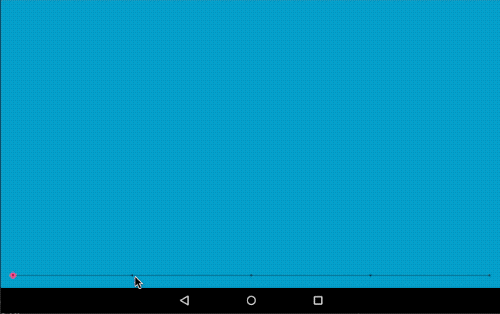
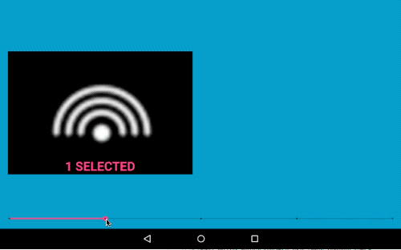

# android_responsiveLayout_testApp
Bare minimum test app rearranging views in a responsive way.

## On Master branch
The 4 views change their position and size according to a set of layout constraints.
The vertical constraints for the views are set relative to a horizontal guideline. The seekbar value adusts the position of this guideline, and the set of constraints then adjusts the views to fit above and below the guideline.


The key element is the combination of the 2 fields in the layout file:
```xml
<ImageView
...
android:layout_width="0dp"
app:layout_constraintWidth_default="wrap"
...
/>
```

as explained [here](https://developer.android.com/training/constraint-layout/#adjust-the-view-size)


## On SetVisibility branch
Change the margin position based on the visibility of the different views.



## On CompoundView branch
Let each component be a compound view instead of a single image view. Dynamically set the text in the compound view.


